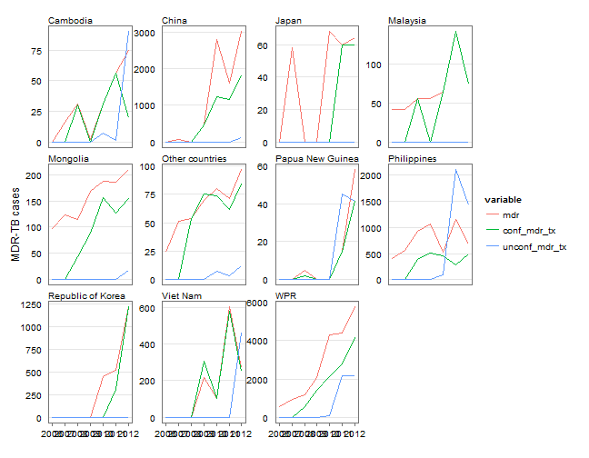
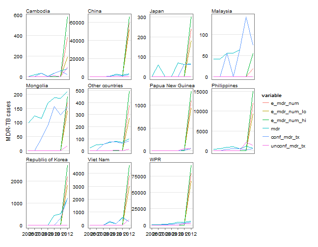
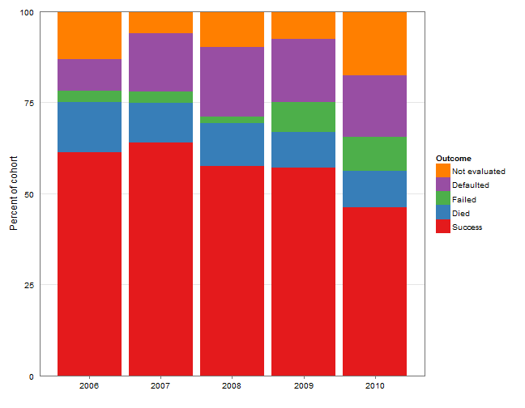
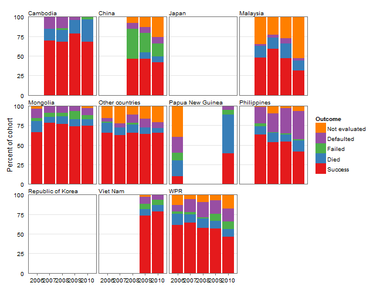

Drug resistant tuberculosis in the WHO Western Pacific Region
========================================================

### Tauhid Islam,^a Tom Hiatt^a and Nobuyuki Nishikiori^a


^a Stop TB and Leprosy Elimination, Division of Combating Communicable Diseases, World Health Organization Regional Office for the Western Pacific, Manila, the Philippines.

Correspondence to Tauhid Islam (e-mail: islamt@wpro.who.int).

Running title: 

Key words: 

Abstract 
--------------------------------------------------------


Introduction
--------------------------------------------------------


Methods
--------------------------------------------------------

[modify this text appropriately.]

### Data
Every year, 36 countries and areas in the Region are requested to report TB surveillance data to WHO using a standardized data collection form. Since 2009, a web-based online system has been used for data submission and validation. Collected data covers the following areas: TB case notifications and treatment outcomes, diagnostic and treatment services, drug management, surveillance and surveys of drug-resistance, information on TB/HIV co-infection, infection control, engagement of all care providers and budgets and expenditures for TB control. The full description of methods is available in the Global Tuberculosis Report 2013 and the data sets are available from the WHO global TB database (www.who.int/tb/data). Case definitions for TB can be found in the 4th edition of the TB treatment guidelines.^4 In 2013, 30 countries and areas of the Western Pacific Region reported data representing more than 99.9% of the total population. This report described the epidemiological situation and progress in programmatic response with a focus on seven countries with a high burden of TB: Cambodia, China, the Lao People's Democratic Republic, Mongolia, Papua New Guinea, the Philippines and Viet Nam. (Globally, WHO designates 22 countries with a high burden of TB that include Cambodia, China, the Philippines and Viet Nam. The other three countries: the Lao People's Democratic Republic, Mongolia and Papua New Guinea are considered priority countries with a high burden of TB in the Western Pacific Region).

### Analysis and reproducibility
Analysis was conducted by the statistical package R (R Core Team, 2013, Vienna, Austria, www.R-project.org). Due to calls for transparent and reproducible research,^5,6 we have published programme code to generate the entire contents of this article including all figures and tables by using R with the knitr package (Yihui Xie, 2013). Readers can download the code (see supplement material) and reproduce all figures and tables under an appropriate personal computing environment. For non-commercial purposes, readers may modify the code to produce figures and tables that are not presented in this article. For instance, readers may wish to produce tables and figures for countries or regions other than the WHO Western Pacific Region.


Results
--------------------------------------------------------


### Surveillance
#### coverage of drug resistance surveillance: 
<a id="t-notif"></a> 
##### Table NA.			Table or map (survey/ surveillance, single/several data point, 				national/ sub national)
		
#### MDR-TB rate:
<a id="t-notif"></a> 
##### Table NA.			Table: rate among new and reTx, CI, year, number of country year 				data point

			(R resistance data need to be included as separate column)

#### XDR-TB:
<a id="t-notif"></a> 
##### Table NA.			Table, number and year of reporting

#### Resistance to SLD: 
<a id="t-notif"></a> 
##### Table NA.			Rate (FQ and injectable)

#### Trends in drug resistance:
<a id="t-notif"></a> 
##### Table NA.			Possible?? Graph?
	
### Management of drug resistant TB
		
#### DST coverage
<a id="t-notif"></a> 
##### Table NA.			Table : % of DST result among new and reTx
			
#### Notification and enrolment
<a id="t-notif"></a> 
##### Table NA.			Year, number notified and enrolled, % of total burden
			Age, sex? Child MDR-TB?

#### Alignment


a id="f-align"></a> 
##### Figure NA. Trend of notification and enrolment of MDR-TB cases in the Western Pacific Region, 2006--2010
Graph showing notification and enrolment
  

<

#### Treatment outcomes


<a id="f-mtxout-bar"></a> 
##### Figure 2.	Trend of treatment outcome expressed as a proportion among MDR-TB cases in the Western Pacific Region, 2006--2010
 

```
## Warning: Removed 5 rows containing missing values (position_stack).
## Warning: Removed 10 rows containing missing values (position_stack).
## Warning: Removed 25 rows containing missing values (position_stack).
## Warning: no non-missing arguments to min; returning Inf
## Warning: no non-missing arguments to max; returning -Inf
## Warning: position_stack requires constant width: output may be incorrect
## Warning: Removed 5 rows containing missing values (position_stack).
## Warning: Removed 15 rows containing missing values (position_stack).
## Warning: Removed 5 rows containing missing values (position_stack).
## Warning: Removed 25 rows containing missing values (position_stack).
## Warning: no non-missing arguments to min; returning Inf
## Warning: no non-missing arguments to max; returning -Inf
## Warning: position_stack requires constant width: output may be incorrect
## Warning: Removed 15 rows containing missing values (position_stack).
```

 


Discussion
---------------------------------------------------

### WPRO response
		
#### rGLC and  activities


### Issues & way forward


Conflicts of interest
--------------------------------------------------------
None declared.

Funding
--------------------------------------------------------
None.

References
--------------------------------------------------------

1. Global Tuberculosis Report 2013. Geneva, World Health Organization, 2013 (http://www.who.int/tb/publications/global_report/en/, accessed 15 March 2014). 


### Case notification


