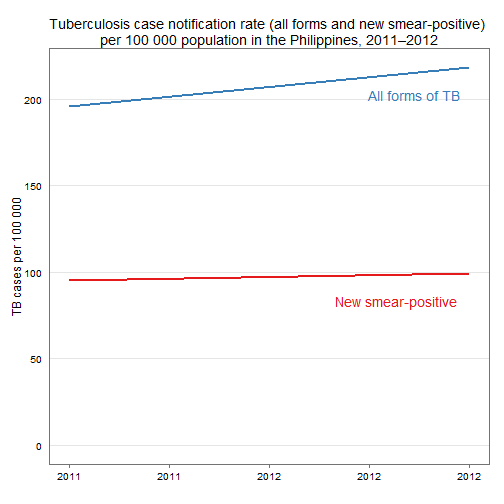
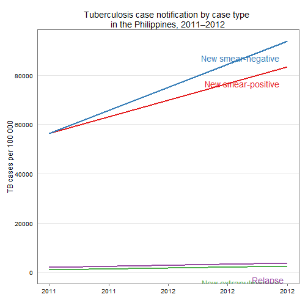
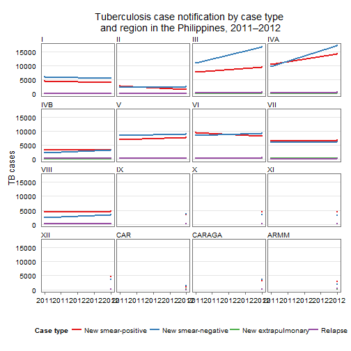
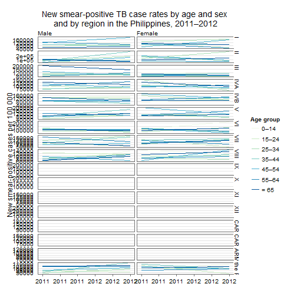
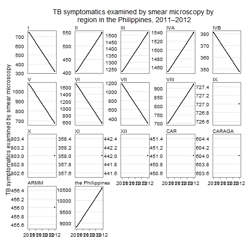

Tuberculosis in the Philippines: analysis of case notification data in 2013
========================================================

1.  Introduction
--------------------------------------------------------

2.	Accomplishment (Drug susceptible)
--------------------------------------------------------

### a.	Case notification for all TB cases -2000 to 2013

#### i.	National - by type of TB cases (new smear positive, new smear negative, EP, relapse and re-treatment cases) annually

 


 


#### ii.	Regional - y type of TB cases (new smear positive, new smear negative, EP, relapse and re-treatment cases) annually


```
## geom_path: Each group consist of only one observation. Do you need to adjust the group aesthetic?
## geom_path: Each group consist of only one observation. Do you need to adjust the group aesthetic?
## geom_path: Each group consist of only one observation. Do you need to adjust the group aesthetic?
## geom_path: Each group consist of only one observation. Do you need to adjust the group aesthetic?
## geom_path: Each group consist of only one observation. Do you need to adjust the group aesthetic?
## geom_path: Each group consist of only one observation. Do you need to adjust the group aesthetic?
## geom_path: Each group consist of only one observation. Do you need to adjust the group aesthetic?
```

 


### b.	Case notification for new smear positive by age and sex annually

#### i.	National

#### ii.  Regional


```
## geom_path: Each group consist of only one observation. Do you need to adjust the group aesthetic?
## geom_path: Each group consist of only one observation. Do you need to adjust the group aesthetic?
## geom_path: Each group consist of only one observation. Do you need to adjust the group aesthetic?
## geom_path: Each group consist of only one observation. Do you need to adjust the group aesthetic?
## geom_path: Each group consist of only one observation. Do you need to adjust the group aesthetic?
## geom_path: Each group consist of only one observation. Do you need to adjust the group aesthetic?
## geom_path: Each group consist of only one observation. Do you need to adjust the group aesthetic?
## geom_path: Each group consist of only one observation. Do you need to adjust the group aesthetic?
## geom_path: Each group consist of only one observation. Do you need to adjust the group aesthetic?
## geom_path: Each group consist of only one observation. Do you need to adjust the group aesthetic?
## geom_path: Each group consist of only one observation. Do you need to adjust the group aesthetic?
## geom_path: Each group consist of only one observation. Do you need to adjust the group aesthetic?
## geom_path: Each group consist of only one observation. Do you need to adjust the group aesthetic?
## geom_path: Each group consist of only one observation. Do you need to adjust the group aesthetic?
```

 


### c.	Casefinding

#### i.	National - Number of TB symptomatics examined by smear microscopy by year 

#### ii.	Regional - Number of TB symptomatics examined by smear microscopy by year 
(Should this be per population to make it comparable?)


```
## geom_path: Each group consist of only one observation. Do you need to adjust the group aesthetic?
## geom_path: Each group consist of only one observation. Do you need to adjust the group aesthetic?
## geom_path: Each group consist of only one observation. Do you need to adjust the group aesthetic?
## geom_path: Each group consist of only one observation. Do you need to adjust the group aesthetic?
## geom_path: Each group consist of only one observation. Do you need to adjust the group aesthetic?
## geom_path: Each group consist of only one observation. Do you need to adjust the group aesthetic?
## geom_path: Each group consist of only one observation. Do you need to adjust the group aesthetic?
```

 


#### iii.	Summary of laboratory activities per year per region

1.	Number of TB symptomatics examined
2.	Number with three sputum specimens
3.	Number of smear positive
4.	Positivity rate

### d.	Caseholding

#### i.	National

1.	New smear positive
2.	New smear negative
3.	Relapse + Failure + RAD

#### ii.	National

1.	New smear positive
2.	New smear negative
3.	Relapse + Failure + RAD

3.	Accomplishment (Drug resistant) 2000 to 2013
--------------------------------------------------------

### a.	Casefinding

#### i.	National

### b.	Caseholding

#### i.	National 

4.	Accomplishment – Children
--------------------------------------------------------

5.	Accomplishment – PPMD
--------------------------------------------------------

6.	Accomplishment – Jails and Prisons
--------------------------------------------------------

7.	Accomplishment – TB/HIV
--------------------------------------------------------

8.	Policies
--------------------------------------------------------

9.	Budget
--------------------------------------------------------

10.	Partners
--------------------------------------------------------

