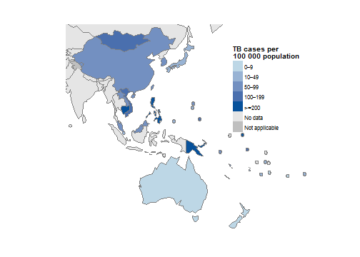
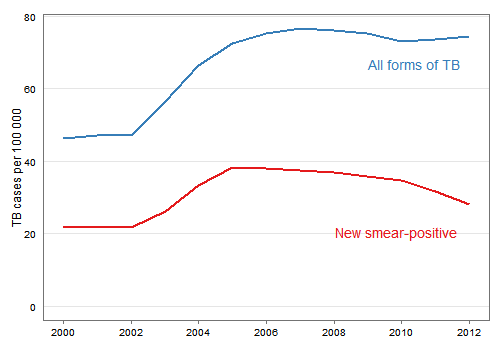
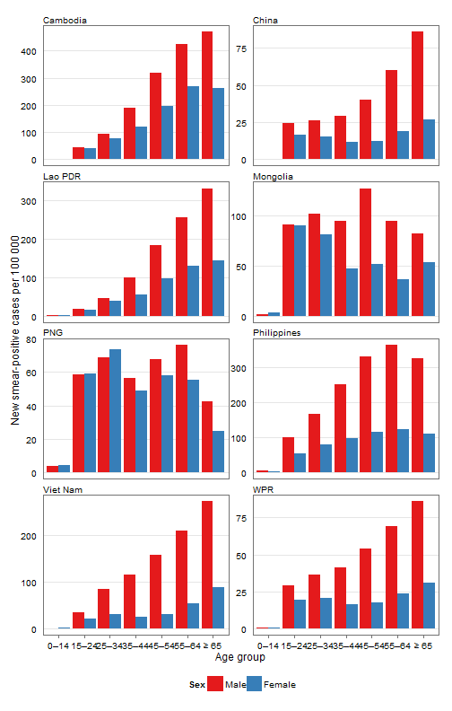
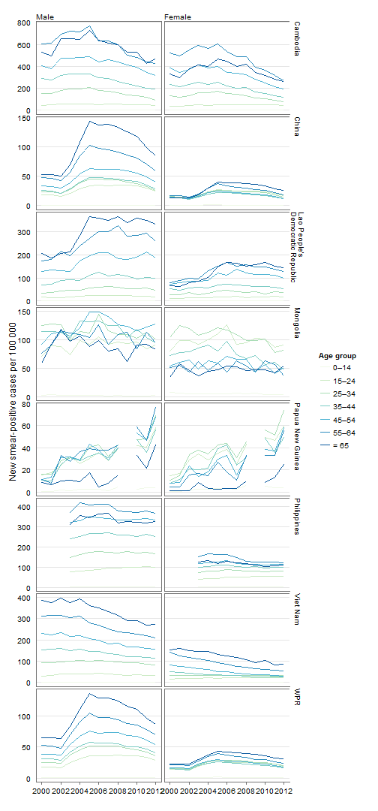
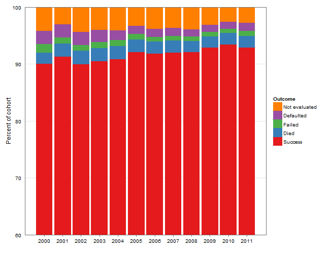
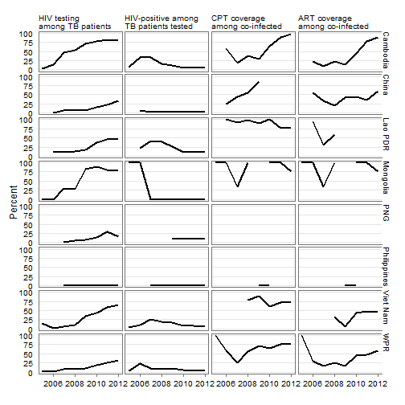

Epidemiology and control of tuberculosis in the Western Pacific Region: analysis of case notification data in 2012
========================================================

### Tom Hiatt^a and Nobuyuki Nishikiori^a

^a Stop TB and Leprosy Elimination, Division of Combating Communicable Diseases, World Health Organization Regional Office for the Western Pacific, Manila, the Philippines.

Correspondence to Tom Hiatt (e-mail: hiattt@wpro.who.int).

Abstract 
--------------------------------------------------------

Tuberculosis (TB) control in the World Health Organization (WHO) Western Pacific Region has seen substantial progress in the last decade with a 33% reduction in prevalent TB cases since 2000. The burden remains immense however, and national TB programmes must evolve and adapt to build upon these gains. Through routine surveillance, countries and areas in the Region reported 1.4 million TB cases in 2012. The case notification rate increased in the early 2000s, appears to have stabilized in recent years and is in decline for all forms and new smear-positive cases. The age and sex breakdown for smear-positive TB case rates by country shows generally higher rates with increased age and declining rates over time for all age groups. Treatment success remains high in the Region with 15 countries reaching or maintaining an 85% success rate. HIV testing among TB patients has increased gradually along with a slow decline in the number of HIV-positive patients found.

The trend of TB notification is heavily influenced by programmatic improvements in many countries and rapidly changing demographics. It appears that cases are being found earlier as reflected in declining rates of smear-positive TB with steady rates of TB in all forms. WHO estimates depict a decline in TB incidence in the Region. HIV testing, while still low, has increased substantially in recent years with essential TB/HIV services expanding in many countries.

TB surveillance data, within inherent limitations, is an important source of programmatic and epidemiological information. Careful interpretation of these findings can provide useful insight for programmatic decision-making.

Introduction
--------------------------------------------------------

Significant progress has been made in tuberculosis (TB) control in the World Health Organization (WHO) Western Pacific Region especially in the past decade. The number of prevalent TB patients in the Region fell from 3.6 million in 2000 to 2.4 million in 2012.^1 During the same period, over 10 million patients were diagnosed and treated, and an estimated 800 000 deaths were averted.^2 According to the latest WHO estimates, the Region is on track for achieving the TB-related Millennium Development Goals (MDGs) and other international targets by 2015. However, with 1.4 million TB patients notified annually in the Region and several countries with a persistent substantial disease burden, TB control policies and strategies require continuous evolution to adopt new tools and approaches as well as to address emerging challenges faced by national TB control programmes. In light of the MDG target date approaching, WHO has embarked on an extensive consultative process of developing the new Global TB Strategy after 2015.^3 At this critical period of strategy renewal, a thorough analysis of surveillance data provides valuable information on the current epidemiological situation, programmatic progress and future directions.

This article represents our first attempt to report a regional analysis of TB notification data as an article in the Western Pacific Surveillance and Response Journal. Throughout the year of 2014 and beyond, we plan to conduct a series of further regional analyses on various topics such as subnational data analysis and utilization, the situation of drug-resistant TB, contact investigation and other forms of TB screening activities to stimulate the utilization of surveillance data for informed programme decision-making.

Methods
--------------------------------------------------------

### Data
Every year, 36 countries and areas in the Region are requested to report TB surveillance data to WHO using a standardized data collection form. Since 2009, a web-based online system has been used for data submission and validation. Collected data covers the following areas: TB case notifications and treatment outcomes, diagnostic and treatment services, drug management, surveillance and surveys of drug-resistance, information on TB/HIV co-infection, infection control, engagement of all care providers and budgets and expenditures for TB control. The full description of methods is available in the Global Tuberculosis Report 2013 and the data sets are available from the WHO global TB database (www.who.int/tb/data). Case definitions for TB can be found in the 4th edition of the TB treatment guidelines.^4 In 2013, 30 countries and areas of the Western Pacific Region reported data representing more than 99.9% of the total population. This report described the epidemiological situation and progress in programmatic response with a focus on seven countries with a high burden of TB: Cambodia, China, the Lao People's Democratic Republic, Mongolia, Papua New Guinea, the Philippines and Viet Nam. (Globally, WHO designates 22 countries with a high burden of TB that include Cambodia, China, the Philippines and Viet Nam. The other three countries: the Lao People's Democratic Republic, Mongolia and Papua New Guinea are considered priority countries with a high burden of TB in the Western Pacific Region).

### Analysis and reproducibility
Analysis was conducted by the statistical package R (R Core Team, 2013, Vienna, Austria, www.R-project.org). Due to calls for transparent and reproducible research,^5,6 we have published programme code to generate the entire contents of this article including all figures and tables by using R with the knitr package (Yihui Xie, 2013). Readers can download the code (see supplement material) and reproduce all figures and tables under an appropriate personal computing environment. For non-commercial purposes, readers may modify the code to produce figures and tables that are not presented in this article. For instance, readers may wish to produce tables and figures for countries or regions other than the WHO Western Pacific Region.

Results
--------------------------------------------------------

### Case notification

In 2012, countries and areas in the Region reported 1 410 835 people with TB disease ([Table 1](#t-notif)) making up 23% of the global burden. Of these cases, 97.5% (1 375 713) were new episodes of TB disease (either new or relapse cases). Within the Region China accounts for 64% (900 678) of the caseload with the Philippines and Viet Nam following with 16% (230 162) and 7% (103 906), respectively. TB notification rates, expressed as cases per 100 000 population, vary substantially in the Region with the highest rates found in Kiribati, Papua New Guinea, the Marshall Islands, Cambodia and the Philippines (343, 287, 276, 270 and 224 per 100 000 population, respectively ([Table 1](#t-notif), [Figure 1](#m-notif)). 

 
#### Table 1. Tuberculosis case notification from countries and areas of the Western Pacific Region, 2012
<!-- html table generated in R 3.0.2 by xtable 1.7-1 package -->
<!-- Fri Apr 11 12:01:49 2014 -->
<TABLE border=0 rules=rows width=900 cellpadding=5>
  <TR> <TD colspan=3></TD> 
  <TH colspan=7>NEW CASES</TH> 
  <TH colspan=2>RETREATMENT CASES</TH> 
  <TD colspan=1></TD> </TR> 
  <TR> <TD></TD> <TD>TOTAL NOTIFIED</TD>
  <TD>TOTAL NOTIFIED PER 100 000</TD>
  <TD>SMEAR- POSITIVE</TD> 
  <TD>SMEAR- NEGATIVE</TD> 
  <TD>SMEAR NOT DONE</TD>
  <TD>EXTRA- PULMONARY</TD> 
  <TD>CASE TYPE  UNKNOWN</TD> 
  <TD>PULMONARY CASES LABORATORY CONFIRMED</TD> 
  <TD>PERCENTAGE OF PULMONARY CASES LABORATORY CONFIRMED</TD>   
  <TD>RELAPSE</TD> 
  <TD>RETREATMENT EXCL. RELAPSE</TD> 
  <TD>NEW AND RELAPSE(a)</TD> 
 </TR> <TR> <TD> American Samoa </TD> <TD>  </TD> <TD>  </TD> <TD>  </TD> <TD>  </TD> <TD>  </TD> <TD>  </TD> <TD>  </TD> <TD>  </TD> <TD> -- </TD> <TD>  </TD> <TD>  </TD> <TD>  </TD> </TR>
  <TR> <TD> Australia </TD> <TD> 1 325 </TD> <TD> 6 </TD> <TD> 290 </TD> <TD> 330 </TD> <TD> 78 </TD> <TD> 498 </TD> <TD> 63 </TD> <TD> 667 </TD> <TD> 96 </TD> <TD> 26 </TD> <TD> 20 </TD> <TD> 1 305 </TD> </TR>
  <TR> <TD> Brunei Darussalam </TD> <TD> 243 </TD> <TD> 59 </TD> <TD> 119 </TD> <TD> 51 </TD> <TD> 28 </TD> <TD> 31 </TD> <TD> 0 </TD> <TD> 166 </TD> <TD> 84 </TD> <TD> 14 </TD> <TD> 0 </TD> <TD> 243 </TD> </TR>
  <TR> <TD> Cambodia </TD> <TD> 40 258 </TD> <TD> 270 </TD> <TD> 14 838 </TD> <TD> 8 509 </TD> <TD> 0 </TD> <TD> 15 290 </TD> <TD> 0 </TD> <TD> 14 838 </TD> <TD> 64 </TD> <TD> 446 </TD> <TD> 73 </TD> <TD> 40 185 </TD> </TR>
  <TR> <TD> China </TD> <TD> 900 678 </TD> <TD> 65 </TD> <TD> 316 332 </TD> <TD> 533 977 </TD> <TD> 2 073 </TD> <TD> 6 479 </TD> <TD> 0 </TD> <TD> 316 332 </TD> <TD> 37 </TD> <TD> 31 784 </TD> <TD> 10 033 </TD> <TD> 890 645 </TD> </TR>
  <TR> <TD> Hong Kong Special Administrative Region (China) </TD> <TD> 4 969 </TD> <TD> 67 </TD> <TD> 1 463 </TD> <TD> 2 004 </TD> <TD> 202 </TD> <TD> 817 </TD> <TD> 0 </TD> <TD> 2 704 </TD> <TD> 74 </TD> <TD> 323 </TD> <TD> 160 </TD> <TD> 4 809 </TD> </TR>
  <TR> <TD> Macao Special Administrative Region (China) </TD> <TD> 406 </TD> <TD> 73 </TD> <TD> 156 </TD> <TD> 137 </TD> <TD> 2 </TD> <TD> 31 </TD> <TD> 0 </TD> <TD> 241 </TD> <TD> 82 </TD> <TD> 26 </TD> <TD> 2 </TD> <TD> 404 </TD> </TR>
  <TR> <TD> Cook Islands </TD> <TD> 1 </TD> <TD> 5 </TD> <TD> 0 </TD> <TD> 0 </TD> <TD> 0 </TD> <TD> 0 </TD> <TD> 0 </TD> <TD> 0 </TD> <TD> -- </TD> <TD> 1 </TD> <TD> 0 </TD> <TD> 1 </TD> </TR>
  <TR> <TD> Fiji </TD> <TD> 218 </TD> <TD> 24 </TD> <TD> 111 </TD> <TD> 54 </TD> <TD> 0 </TD> <TD> 40 </TD> <TD> 0 </TD> <TD> 165 </TD> <TD> 100 </TD> <TD> 5 </TD> <TD> 8 </TD> <TD> 210 </TD> </TR>
  <TR> <TD> French Polynesia </TD> <TD> 50 </TD> <TD> 18 </TD> <TD> 26 </TD> <TD> 10 </TD> <TD> 0 </TD> <TD> 8 </TD> <TD> 0 </TD> <TD> 33 </TD> <TD> 92 </TD> <TD> 6 </TD> <TD> 0 </TD> <TD> 50 </TD> </TR>
  <TR> <TD> Guam </TD> <TD> 68 </TD> <TD> 42 </TD> <TD> 23 </TD> <TD> 23 </TD> <TD> 14 </TD> <TD> 8 </TD> <TD> 0 </TD> <TD> 31 </TD> <TD> 52 </TD> <TD> 0 </TD> <TD> 0 </TD> <TD> 68 </TD> </TR>
  <TR> <TD> Japan </TD> <TD> 21 283 </TD> <TD> 16 </TD> <TD> 7 663 </TD> <TD> 7 454 </TD> <TD> 221 </TD> <TD> 4 609 </TD> <TD> 0 </TD> <TD> 13 013 </TD> <TD> 85 </TD> <TD> 910 </TD> <TD> 426 </TD> <TD> 20 857 </TD> </TR>
  <TR> <TD> Kiribati </TD> <TD> 348 </TD> <TD> 343 </TD> <TD> 134 </TD> <TD> 122 </TD> <TD> 0 </TD> <TD> 73 </TD> <TD> 9 </TD> <TD> 134 </TD> <TD> 52 </TD> <TD> 8 </TD> <TD> 2 </TD> <TD> 346 </TD> </TR>
  <TR> <TD> Lao People's Democratic Republic </TD> <TD> 4 156 </TD> <TD> 62 </TD> <TD> 3 062 </TD> <TD> 484 </TD> <TD>  </TD> <TD> 351 </TD> <TD>  </TD> <TD> 3 062 </TD> <TD> 86 </TD> <TD> 168 </TD> <TD> 38 </TD> <TD> 4 118 </TD> </TR>
  <TR> <TD> Malaysia </TD> <TD> 22 710 </TD> <TD> 75 </TD> <TD> 13 311 </TD> <TD> 4 941 </TD> <TD> 52 </TD> <TD> 2 945 </TD> <TD> 0 </TD> <TD> 13 311 </TD> <TD> 73 </TD> <TD> 602 </TD> <TD> 859 </TD> <TD> 21 851 </TD> </TR>
  <TR> <TD> Marshall Islands </TD> <TD> 147 </TD> <TD> 276 </TD> <TD> 54 </TD> <TD> 39 </TD> <TD> 14 </TD> <TD> 29 </TD> <TD> 0 </TD> <TD> 54 </TD> <TD> 50 </TD> <TD> 4 </TD> <TD> 2 </TD> <TD> 145 </TD> </TR>
  <TR> <TD> Micronesia, Federated States of </TD> <TD> 146 </TD> <TD> 139 </TD> <TD> 43 </TD> <TD> 75 </TD> <TD> 2 </TD> <TD> 22 </TD> <TD> 0 </TD> <TD> 58 </TD> <TD> 48 </TD> <TD> 2 </TD> <TD> 2 </TD> <TD> 144 </TD> </TR>
  <TR> <TD> Mongolia </TD> <TD> 4 453 </TD> <TD> 148 </TD> <TD> 1 716 </TD> <TD> 617 </TD> <TD> 0 </TD> <TD> 1 611 </TD> <TD> 0 </TD> <TD> 1 716 </TD> <TD> 74 </TD> <TD> 184 </TD> <TD> 325 </TD> <TD> 4 128 </TD> </TR>
  <TR> <TD> Nauru </TD> <TD>  </TD> <TD>  </TD> <TD>  </TD> <TD>  </TD> <TD>  </TD> <TD>  </TD> <TD>  </TD> <TD>  </TD> <TD> -- </TD> <TD>  </TD> <TD>  </TD> <TD>  </TD> </TR>
  <TR> <TD> New Caledonia </TD> <TD> 38 </TD> <TD> 15 </TD> <TD> 13 </TD> <TD> 11 </TD> <TD> 0 </TD> <TD> 12 </TD> <TD> 1 </TD> <TD> 24 </TD> <TD> 100 </TD> <TD> 1 </TD> <TD> 0 </TD> <TD> 38 </TD> </TR>
  <TR> <TD> New Zealand </TD> <TD> 297 </TD> <TD> 7 </TD> <TD> 68 </TD> <TD> 88 </TD> <TD> 11 </TD> <TD> 112 </TD> <TD> 3 </TD> <TD> 143 </TD> <TD> 86 </TD> <TD> 11 </TD> <TD> 4 </TD> <TD> 293 </TD> </TR>
  <TR> <TD> Niue </TD> <TD> 0 </TD> <TD> 0 </TD> <TD> 0 </TD> <TD> 0 </TD> <TD> 0 </TD> <TD> 0 </TD> <TD> 0 </TD> <TD> 0 </TD> <TD> -- </TD> <TD> 0 </TD> <TD> 0 </TD> <TD> 0 </TD> </TR>
  <TR> <TD> Northern Mariana Islands </TD> <TD> 34 </TD> <TD> 60 </TD> <TD> 10 </TD> <TD> 17 </TD> <TD> 0 </TD> <TD> 4 </TD> <TD> 1 </TD> <TD> 15 </TD> <TD> 56 </TD> <TD> 0 </TD> <TD> 2 </TD> <TD> 32 </TD> </TR>
  <TR> <TD> Palau </TD> <TD> 4 </TD> <TD> 19 </TD> <TD> 3 </TD> <TD> 1 </TD> <TD> 0 </TD> <TD> 0 </TD> <TD> 0 </TD> <TD> 3 </TD> <TD> 75 </TD> <TD> 0 </TD> <TD> 0 </TD> <TD> 4 </TD> </TR>
  <TR> <TD> Papua New Guinea </TD> <TD> 22 488 </TD> <TD> 287 </TD> <TD> 2 862 </TD> <TD> 2 046 </TD> <TD> 7 149 </TD> <TD> 8 277 </TD> <TD> 0 </TD> <TD> 2 862 </TD> <TD> 24 </TD> <TD> 223 </TD> <TD> 1 931 </TD> <TD> 20 557 </TD> </TR>
  <TR> <TD> Philippines </TD> <TD> 230 162 </TD> <TD> 224 </TD> <TD> 94 006 </TD> <TD> 115 263 </TD> <TD> 0 </TD> <TD> 3 274 </TD> <TD> 0 </TD> <TD> 94 006 </TD> <TD> 45 </TD> <TD> 4 084 </TD> <TD> 13 535 </TD> <TD> 216 627 </TD> </TR>
  <TR> <TD> Republic of Korea </TD> <TD> 49 532 </TD> <TD> 89 </TD> <TD> 12 137 </TD> <TD> 15 622 </TD> <TD> 3 316 </TD> <TD> 8 470 </TD> <TD> 0 </TD> <TD> 28 397 </TD> <TD> 91 </TD> <TD> 4 157 </TD> <TD> 5 830 </TD> <TD> 43 702 </TD> </TR>
  <TR> <TD> Samoa </TD> <TD> 22 </TD> <TD> 12 </TD> <TD> 15 </TD> <TD> 4 </TD> <TD> 0 </TD> <TD> 3 </TD> <TD> 0 </TD> <TD> 19 </TD> <TD> 100 </TD> <TD> 0 </TD> <TD> 0 </TD> <TD> 22 </TD> </TR>
  <TR> <TD> Singapore </TD> <TD> 2 364 </TD> <TD> 43 </TD> <TD> 678 </TD> <TD> 1 093 </TD> <TD> 126 </TD> <TD> 306 </TD> <TD> 0 </TD> <TD> 1 206 </TD> <TD> 64 </TD> <TD> 98 </TD> <TD> 63 </TD> <TD> 2 301 </TD> </TR>
  <TR> <TD> Solomon Islands </TD> <TD> 372 </TD> <TD> 66 </TD> <TD> 157 </TD> <TD> 87 </TD> <TD> 0 </TD> <TD> 112 </TD> <TD> 0 </TD> <TD> 157 </TD> <TD> 64 </TD> <TD> 5 </TD> <TD> 11 </TD> <TD> 361 </TD> </TR>
  <TR> <TD> Tokelau </TD> <TD>  </TD> <TD>  </TD> <TD>  </TD> <TD>  </TD> <TD>  </TD> <TD>  </TD> <TD>  </TD> <TD>  </TD> <TD> -- </TD> <TD>  </TD> <TD>  </TD> <TD>  </TD> </TR>
  <TR> <TD> Tonga </TD> <TD> 11 </TD> <TD> 10 </TD> <TD> 9 </TD> <TD> 1 </TD> <TD> 0 </TD> <TD> 1 </TD> <TD> 0 </TD> <TD> 10 </TD> <TD> 100 </TD> <TD> 0 </TD> <TD> 0 </TD> <TD> 11 </TD> </TR>
  <TR> <TD> Tuvalu </TD> <TD> 20 </TD> <TD> 193 </TD> <TD> 8 </TD> <TD> 2 </TD> <TD> 0 </TD> <TD> 9 </TD> <TD> 0 </TD> <TD> 9 </TD> <TD> 90 </TD> <TD> 0 </TD> <TD> 1 </TD> <TD> 19 </TD> </TR>
  <TR> <TD> Vanuatu </TD> <TD> 126 </TD> <TD> 51 </TD> <TD> 51 </TD> <TD> 22 </TD> <TD> 0 </TD> <TD> 51 </TD> <TD> 0 </TD> <TD> 73 </TD> <TD> 100 </TD> <TD> 1 </TD> <TD> 1 </TD> <TD> 125 </TD> </TR>
  <TR> <TD> Viet Nam </TD> <TD> 103 906 </TD> <TD> 112 </TD> <TD> 51 033 </TD> <TD> 21 706 </TD> <TD>  </TD> <TD> 18 904 </TD> <TD> 3 210 </TD> <TD> 51 033 </TD> <TD> 70 </TD> <TD> 7 259 </TD> <TD> 1 794 </TD> <TD> 102 112 </TD> </TR>
  <TR> <TD> Wallis and Futuna Islands </TD> <TD>  </TD> <TD>  </TD> <TD>  </TD> <TD>  </TD> <TD>  </TD> <TD>  </TD> <TD>  </TD> <TD>  </TD> <TD> -- </TD> <TD>  </TD> <TD>  </TD> <TD>  </TD> </TR>
  <TR> <TD> Western Pacific Region
 </TD> <TD> 1 410 835 </TD> <TD> 75 </TD> <TD> 520 391 </TD> <TD> 714 790 </TD> <TD> 13 288 </TD> <TD> 72 377 </TD> <TD> 3 287 </TD> <TD> 544 482 </TD> <TD> 44 </TD> <TD> 50 348 </TD> <TD> 35 122 </TD> <TD> 1 375 713 </TD> </TR>
   <TR> <TD colspan=13>Blank cells indicate data not reported. -- indicates values that cannot be calculated. 
(a) NEW AND RELAPSE includes cases for which the treatment history is unknown. Data reported as of 1 October 2013. See ANNEX 4 of Global Tuberculosis Report, 2013. </TD></TR> </TABLE>

 
#### Figure 1 Tuberculosis case notification rate (new and relapse) per 100 000 population in countries and areas of the Western Pacific Region, 2012
 

> The boundaries shown and the designations used on this map do not imply the expression of any opinion whatsoever on the part of the World Health Organization concerning the legal status of any country, territory, city or area or of its authorities, or concerning the delimitation of its frontiers or boundaries. White lines on maps represent approximate border lines for which there may not yet be full agreement.

Between 2002 and 2007, case notification rates in the Region increased from 47 to 77 per 100 000 population in all forms of TB and from 22 to 38 per 100 000 population in new smear-positive TB cases. After 2005 the case notification rates for all forms of TB stabilized, and new smear-positive cases seem to have started to decrease ([Figure 2](#f-notif-trend)). 

 
#### Figure 2 Tuberculosis case notification rate (all forms and new smear-positive) per 100 000 population in the Western Pacific Region, 2000--2012
 

### Distribution by age and sex

[Figure 3](#f-agesex-bar) shows age group and sex-specific case notification rates of new smear-positive cases for the seven countries with a high burden of TB in the Region (note that the scale of the vertical axis is different for each country). Many countries follow a typical pattern for cross-sectional observations with increasing notification rates towards older populations except Mongolia and Papua New Guinea. In general, males are more affected than females with male-to-female TB ratios as high as three as seen in Viet Nam.

 
#### Figure 3 Age group- and sex-specific notification rates (per 100 000 population) of new smear-positive tuberculosis cases in seven countries with a high-burden of TB in the Western Pacific Region, 2012
 

[Figure 4](#f-agesex) shows trends of notification rates of new smear-positive cases of age- and sex-specific groups in the seven countries with a high-burden of TB from 2000–2012. Some countries demonstrated a declining trend of case notification for almost all age- and sex- groups, such as Cambodia, China and Viet Nam while others showed a less apparent trend except Papua New Guinea with a sharply increasing trend.

 
#### Figure 4 Trend of age group- and sex-specific notification rates (per 100 000 population) of new smear-positive tuberculosis cases in seven countries with a high-burden of TB in the Western Pacific Region, 2000--2012
 

### Treatment outcomes

The Region continued observing treatment success rates beyond the target of 85% ([Figure 5](#f-txout-bar)), and the rate has been at 85% or higher over the past several years. Across the Region, 15 countries and areas reached or maintained the 85% treatment success target. Among the countries with a high burden of TB, the treatment success rate was highest in China (96%) followed by Cambodia (94%), Viet Nam (93%), the Lao People's Democratic Republic (92%), the Philippines (90%) and Mongolia (85%). The treatment success rate of Papua New Guinea was the lowest at 69% with approximately a quarter of the 2011 cohort either defaulted or un-evaluated.

 
#### Figure 5 Trend of treatment outcome expressed as a proportion among new pulmonary smear-positive cases in the Western Pacific Region, 2000--2011
 

### TB/HIV co-infection and collaborative activities

There has been some progress in reporting of information on TB/HIV co-infection and collaborative activities in the last several years. [Figure 6](#f-tbhiv) summarizes four basic indicators (HIV testing, HIV positivity rate, co-trimoxazole preventive therapy (CPT) coverage and  antiretroviral 
therapy (ART) coverage) for the seven countries with a high burden of TB. Cambodia reported the most comprehensive data completeness and programmatic progress. The coverage of HIV testing, CPT and ART progressively increased with a steady decrease in the proportion of HIV positive individuals among TB patients.

 
#### Figure 6 Progress in TB/HIV activities in seven countries in the Western Pacific Region with a high burden of TB, 2005--2012
 

Discussion
--------------------------------------------------------

Overall, in 2012, countries and areas of the Western Pacific Region reported 1.4 million TB cases (all forms) and a case notification rate of 75 per 100 000 population, a level similar to the past several years.

It has been known that the rapid increase in case notification between 2002 and 2007 was due to several positive programmatic developments in many countries in the Region such as completion and consolidation of the WHO DOTS strategy expansion; improvement in case reporting, including electronic reporting systems; and efforts to engage all health care providers.^7 Particularly, renewal of infectious disease-related legislation and the establishment of an internet-based disease notification system in China made a substantial contribution to the progress.^8

Although the case notification for all forms of TB appears to be flat since 2007, it is important to note that the new smear-positive case notification rates demonstrate a clear declining trend ([Figure 2](#f-notif-trend)). A possible interpretation is that the true TB incidence has been declining while overall case detection is static because intensified programmatic efforts by national TB programmes for early and increased case detection include smear-negative and extra pulmonary TB. The latest WHO estimates support this explanation with estimated incidence rates showing a consistent, rapidly-declining trend^1 ([Figure 7](#f-est)). 

 
#### Figure 7 Tuberculosis case notification rate per 100 000 population, estimated incidence, prevalence and mortality in the Western Pacific Region, 1990--2012
 

> Red line with certainty band: incidence, black line: case notification rate

In any country where a rapid demographic change is underway, overall notification rates may not reflect a true disease trend in the communities. For instance, an overall case notification trend may appear to be stable because decreasing incidences can be cancelled out by a rapidly increasing proportion of an older population. For this reason, the examination of age- and sex- specific case notification rates is more informative and provides insights for understanding the underlying epidemiological process in a given setting.

The typical pattern of linear increase of notification towards the older populations (such as shown in some countries in [Figure 3](#f-agesex-bar)) has been explained as a widely observed phenomena under a stable TB control situation,^9 reflecting a high annual risk of TB infection in the past when the older population was young. Atypical patterns shown for Papua New Guinea and Mongolia, particularly relatively high notification rates among young and female groups, warrant further investigation. Time trend analysis for age- and sex- notification rates ([Figure 4](#f-agesex)) is useful to detect any specific subgroups among which TB transmission and/or disease progression is particularly active.

One of the critical shortcomings of these analyses is a gross lack of morbidity information among small children because the data is limited to smear-positive cases only. Since the 2006 revision of WHO recording and reporting forms,^10 the number of countries reporting age- and sex-disaggregated data for smear-negative and extra pulmonary cases is increasing and will enable a better assessment of the TB burden among children in future analysis.

HIV infection fuels the TB epidemic, particularly in countries and areas with a high burden of TB. The overall percentage of TB patients tested for HIV in the Region still remained low. However, the figure has substantially increased in the last several years particularly in Cambodia, Viet Nam and the Lao People's Democratic Republic. Essential services such as co-trimoxazole prophylaxis and isoniazid preventive therapy have also expanded in many countries in the Region.

This report provides a snapshot of the epidemiological and programmatic situation of TB in the Western Pacific Region based on the case notification data in 2012. As for any disease surveillance system, the analysis of surveillance data has inherent limitations. TB surveillance covers populations served by care providers linked with the national TB programme. Ideally this would include all known cases in the country; in practice the proportion of cases diagnosed outside of the TB programme and included in national reporting varies depending on the legal framework in the country. The WHO TB Impact Measurement Task Force recommends that countries continuously improve surveillance systems until reported cases can be considered a reliable proxy for incidence.^11 A careful assessment is needed of programmatic progress in the country and the quality of surveillance data when interpreting these findings.

TB surveillance continues to be an important source of information for assessing the situation and measuring the progress for decision-making. WHO Regional Office for the Western Pacific will continue to conduct regional analysis on various topics related to TB epidemiology and programmatic progress, as well as provide support to countries to conduct epidemiological and programmatic assessment at national and subnational levels.

Conflicts of interest
--------------------------------------------------------
None declared.

Funding
--------------------------------------------------------
None.

References
--------------------------------------------------------

1. Global Tuberculosis Report 2013. Geneva, World Health Organization, 2013 (http://www.who.int/tb/publications/global_report/en/, accessed 15 March 2014). 
2. Regional Strategy to Stop Tuberculosis in the Western Pacific 2011–2015. Manila, World Health Organization Regional Office for the Western Pacific, 2011 (http://www.wpro.who.int/tb/documents/policy/2010/regional_strategy/en/, accessed 15 March 2014). 
3. Global strategy and targets for tuberculosis prevention, care and control after 2015. Geneva, World Health Organization, 2013 Nov. Report No.: EB134/12 (http://www.who.int/tb/post2015_tbstrategy.pdf?ua=1, accessed 15 March 2014). 
4. Treatment of Tuberculosis. Guidelines. 4th edition. Geneva, World Health Organization; 2010 http://whqlibdoc.who.int/publications/2010/9789241547833_eng.pdf, accessed 15 March 2014). 
5. Peng RD, Dominici F, Zeger SL. Reproducible epidemiologic research. American Journal of Epidemiology, 2006, 163:783–9. doi:10.1093/aje/kwj093 PMID:16510544
6. Groves T, Godlee F. Open science and reproducible research. BMJ (Clinical Research Ed.), 2012, •••:344. 
7. van-Maaren P et al. Reaching the global tuberculosis control targets in the Western Pacific Region. Bull World Health Organ. SciELO Public Health, 2007, 85:360–3. 
8. Wang L, Liu J, Chin DP. Progress in tuberculosis control and the evolving public-health system in China. Lancet, 2007, 369:691–6. doi:10.1016/S0140-6736(07)60316-X PMID:17321314
9. Rieder HL. Epidemiologic basis of tuberculosis control. International Union Against Tuberculosis and Lung Disease (IUATLD); 1999. 162 p. 
10. Revised TB recording and reporting forms and registers-version 2006. Geneva: World Health Organization; 2006 (http://www.who.int/tb/dots/r_and_r_forms/en/, accessed 15 March 2014). 
11. TB Impact Measurement. Geneva, World Health Organization, 2009.
 

