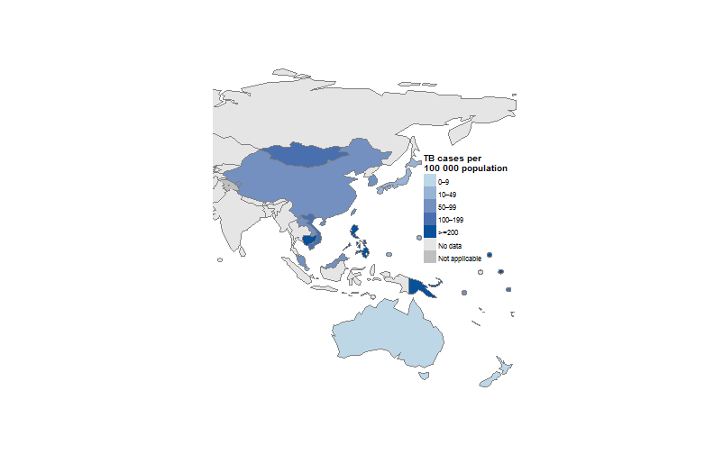
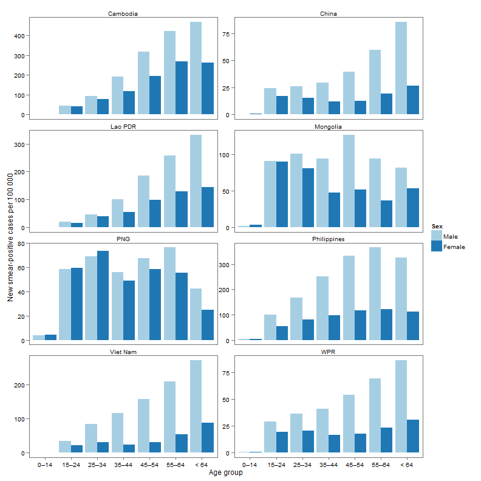
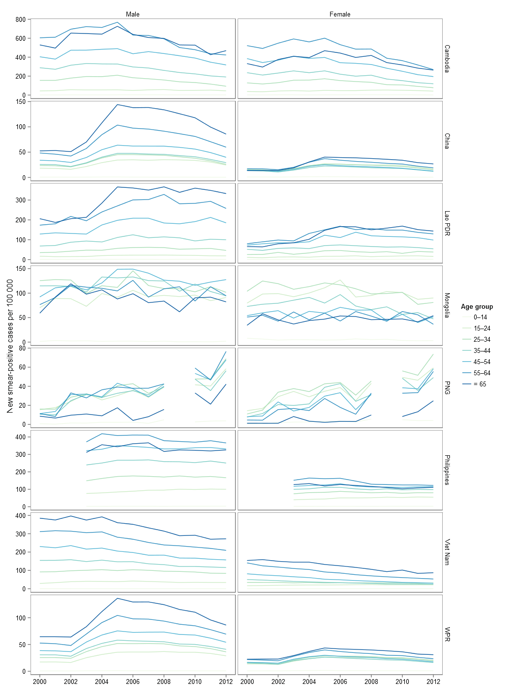

Regional TB report 2013
========================================================

Abstract 
--------------------------------------------------------
(probably remove this section)

Introduction
--------------------------------------------------------

Tuberculosis in the Western Pacific Region

Burden
--------------------------------------------------------


<a id="m.notif"></a> 
#### Figure 1 New and relapse rates per 100 000, 2012.
 


<a id="f.agesex.bar"></a> 
#### Figure 2 Smear-positive notification rates by age and sex in the Region and in seven countries with a high burden of TB, 2012.
 


<a id="f.agesex"></a> 
#### Figure 3 Trends of notification rates of new smear-positive TB cases in specific age and sex groups, 2012.
 


As seen in [Figure 3](#f.agesex) the trend is evident.


And also as seen in [Table 1](#t.notif) the trend is evident.

<a id="t.notif"></a> 
#### Table 1 Case notifications, 2012.

```
## Error: no rows to aggregate
```

```
## Error: object 'tbbh' not found
```

```
## Error: object 'tbbh' not found
```

```
## Error: no rows to aggregate
```

```
## Error: replacement has 1 rows, data has 0
```

```
## Error: no rows to aggregate
```

```
## Error: object 'tbbr' not found
```

```
## Error: object 'tbc' not found
```

```
## Error: object 'tbc' not found
```

```
## Error: object 'tbc' not found
```

```
## Error: object 'tbc' not found
```

```
## Error: object 'tbc' not found
```

```
## Error: object 'tbc' not found
```

```
## Error: object 'tbc' not found
```

```
## Error: object 'tbc' not found
```

```
## Error: object 'tbc' not found
```

```
## Error: object 'tbm' not found
```

```
## Error: error in evaluating the argument 'x' in selecting a method for function 'print': Error: object 'tbm' not found
```


And also as seen in [Table 1](#t.notif) the trend is evident.

<a id="t.blogPostDocs"></a> 


PD | NBlog | Year
--- | --- | ---
p1 |  4 | 1
p2 | 10 | 4
p3 |  2 | 2


Editorial Note
--------------------------------------------------------

Annex
--------------------------------------------------------

The annex will go here.
